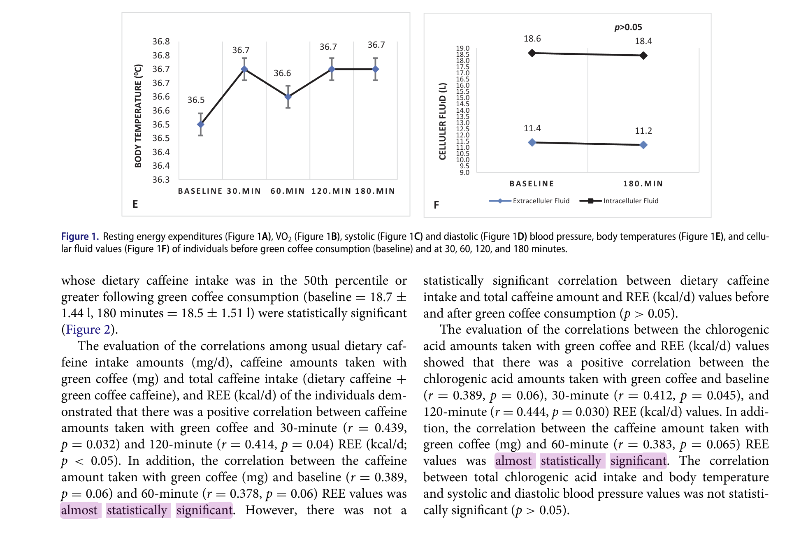

In research, the p-value is often treated as the ultimate test of truth. But should all statistical analysis be held to the same statistical standard? 

In this post, I argue that the p-value is too often used as a universal yardstick, regardless of context or consequences. Sometimes, what counts as “enough” evidence depends on the risks and decisions at stake, not just on whether a result falls below an arbitrary threshold.

{ width="600" }

<!-- more -->

---

## Explaining the p-value

If you're somewhat familiar with law (or have at least watched a courtroom drama... or if you're me, Judge Judy), you'll probably know that there are different standards of proof depending on the type of court. 

In criminal cases, this bar is set really high. A jury must be sure “beyond a reasonable doubt” that the defendant did in fact commit the crime. We can (loosely) quantify this as needing to be ~99.5% certain. In civil disputes, it’s “on the balance of probabilities” — essentially, what’s more likely than not (i.e. being at least 51% sure). 

It makes intuitive sense to say that different situations require different thresholds of confidence for making decisions. In other words, the degree of evidence needed should depend on what's at stake. In criminal court, we can hardly send someone to jail if the evidence _points towards_ but ultimately does not _clearly demonstrate_ that they did in fact carry out the alleged crime. For civil disputes, where neither party faces criminal conviction, the stakes are much lower and consequently the evidence we need to make a judgement is also proportionately lower.

Yet, in statistical research, we often fail to extend this logic. The p-value — usually pegged at 0.05 — is often used as a one-size-fits-all verdict on what counts as evidence. 

At its simplest, the p-value tells us:

> how likely it is to observe results as extreme as the ones we got, just by random chance, if there was actually no effect at all. 

The lower the p-value, the less likely it is that our results are a fluke. Below the _0.05_ threshold, a result is often deemed “statistically significant”; above it, often written off as lacking sufficient evidence. 

The effect of this threshold, I argue, obscures a much more prudent question: _what level of evidence is appropriate for the decision at hand?_

## When good evidence gets thrown out

Consider this hypothetical scenario: a school-based breakfast programme is trialled to see if it improves pupils’ attendance. The study finds a positive effect: among a sample of students with poor baseline attendance, attendance improved by 14% following engagement with the programme.

A statistical researcher plugs the raw data into a model of some kind, and reports this effect alongside a p-value of _0.11_. This misses the conventional threshold of _0.05_ and, consequently, the researcher deems the results as “statistically insignificant.” The school principal, reading the report, decides to drop the breakfast programme entirely. 

But let’s look at the real-world context. Assume that providing breakfast at school is low-cost, low-risk, and easy to implement. The wider literature may also suggest potential knock-on benefits, such as improved community cohesion. In other words, there’s little to lose, and the evidence — though not definitive — certainly suggests a likely benefit. The effect size itself is modest but it's absolutely _practically_ significant, even if not _statistically_ significant. In other words, the programme is likely to make a positive difference to the school.

If this were a civil court, we’d simply ask: is it more likely than not that this intervention is associated with improved attendance? On that standard, the answer is a clear _yes_. The effect size and the p-value, when taken together, cleanly pass a “the balance of probabilities” threshold. Given the low-cost, low-risk nature of the programme, this seems to be vastly more appropriate than applying a “beyond reasonable doubt” standard.

## But sometimes, high stakes = high standards

A separate scenario where we're introducing a new medication would be a completely different story. The risks could be higher (especially if the drug has major side effects), and the consequences more serious. Medical ethics correctly tells us to be vigilant that we're acting in a given patient's best interests. In this case, a much lower p-value — something closer to “beyond reasonable doubt” — is entirely justified and most likely _necessary_. 

The point I'm endeavouring to make is that while relying on fixed, uncritical statistical thresholds may be a convenient rule, it's not a particularly useful or thoughtful one. By insisting on a universal threshold, we end up applying the same standard whether the stakes are routine or life-changing. Worse, it encourages us to treat the result as binary: significant or not, yes or no. This doesn't match the grey, murkiness of real-world uncertainty.

The broader issue here is that statistical prediction is not the same thing as decision-making. Prediction should inform our choices, but complex decisions require a layer of human judgement to mediate between numbers and action. In this way, the p-value should not be used 'checklist' style but rather _interpreted_ within the context of the research topic, as well as related statistical metrics like the point estimate, confidence interval, and measures of dispersion.

*[point estimate]: Our best guess of the population-level effect (e.g. improved attendance by 14%).
*[confidence interval]: A range of plausible values for our point estimate.
*[measures of dispersion]: How varied or 'spread out' our data is. 

## “Almost statistically significant (but not quite)”

Language plays a part. The phrase “not significant” is a way of stepping back from judgment, leaving the interpretation to the number itself. If instead we said, “There is moderate evidence, but uncertainty remains,” we would be more honest — and probably more useful to anyone trying to make a real-world decision. 

Most researchers have felt the frustration of working on a promising project, only for a regression model to return a p-value of, say, _0.054_. It's frustrating precisely because we _know_ that our result does in fact provide moderate evidence towards our research aim, yet they are still “insignificant” in the eyes of conventional wisdom. 

This leads some researchers to adopt awkward (and sometimes quite comical) phrasing. [One study](https://www.tandfonline.com/doi/full/10.1080/07315724.2018.1461147) researching the health impacts of regular consumption of green coffee used the phrase “almost statistically significant” to describe their p-values, which hovered around _0.06_. On the face of it, “almost significant” is a funny turn of phrase — a bit like saying someone is “almost pregnant.” But in a way, it’s also a perfectly reasonable instinct: real-world evidence doesn’t suddenly flick from ‘significant’ to ‘not’ just because you’ve crossed a decimal point. The researchers are right for trying to express that nuance, even if the language of significance drags them into binary thinking.

/// caption
A published research paper using the phrase ‘almost statistically significant’ for p-values just missing the conventional threshold.
///

I do want to be transparent here: everything I've said above isn't a wholly novel critique. Many have already been arguing for a more nuanced approach before, particularly in epidemiology where framing of the p-value in terms of providing “low / moderate / strong / very strong” evidence against a hypothesis has already started to take hold. 

But still, the checkbox culture of significance is still rife, across clinical and social sciences alike. We can do better by recognising that standards of evidence are highly nuanced, context dependent, and must be an exercise of interpretation and discussion, not a mechanical tick-box exercise dictated by an arbitrary threshold.

In the end, statistics is a tool for making sense of uncertainty, not erasing it. A p-value is just one part of the story. The real work lies in making thoughtful decisions about what evidence means for the world outside the dataset.
